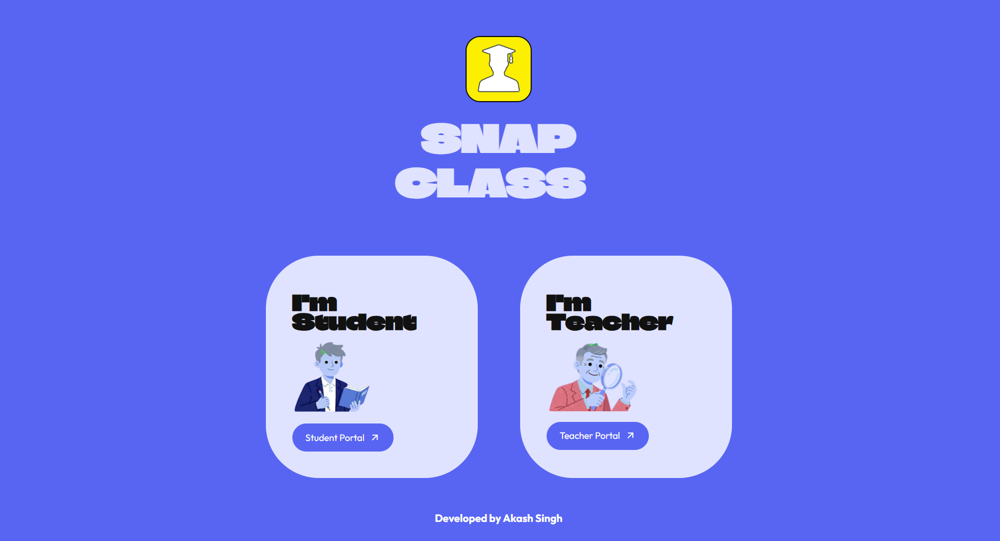
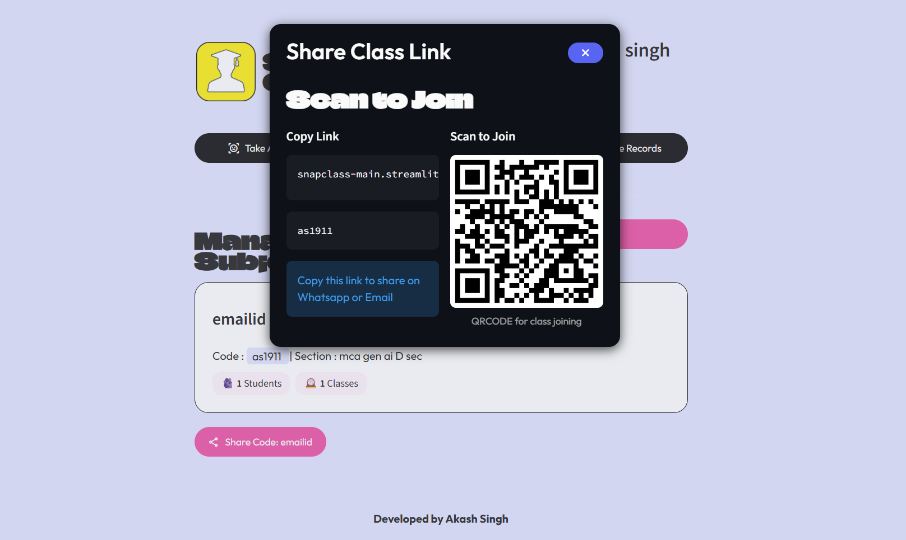
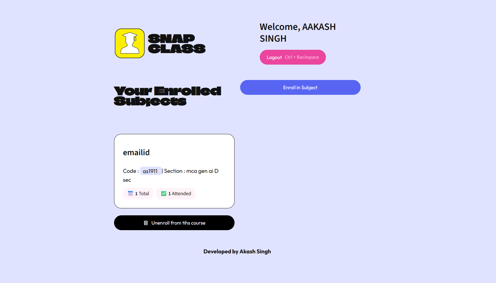
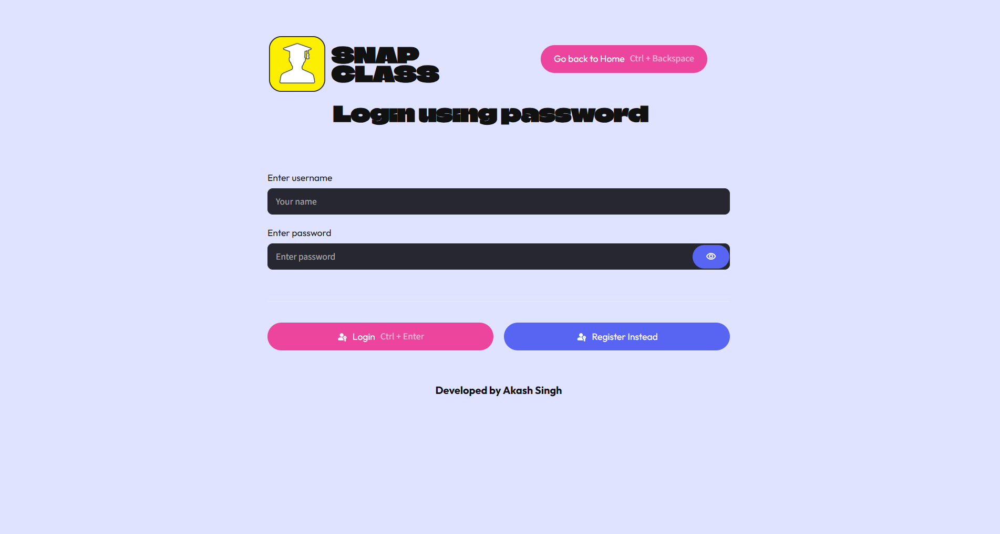
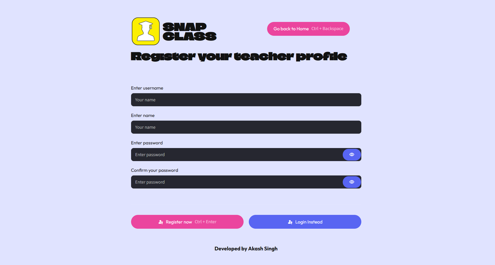
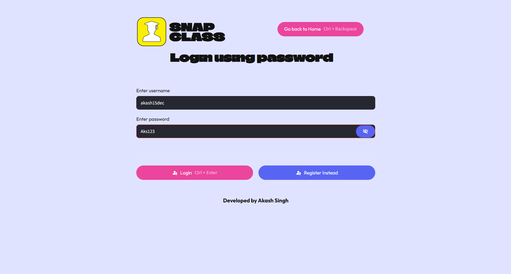
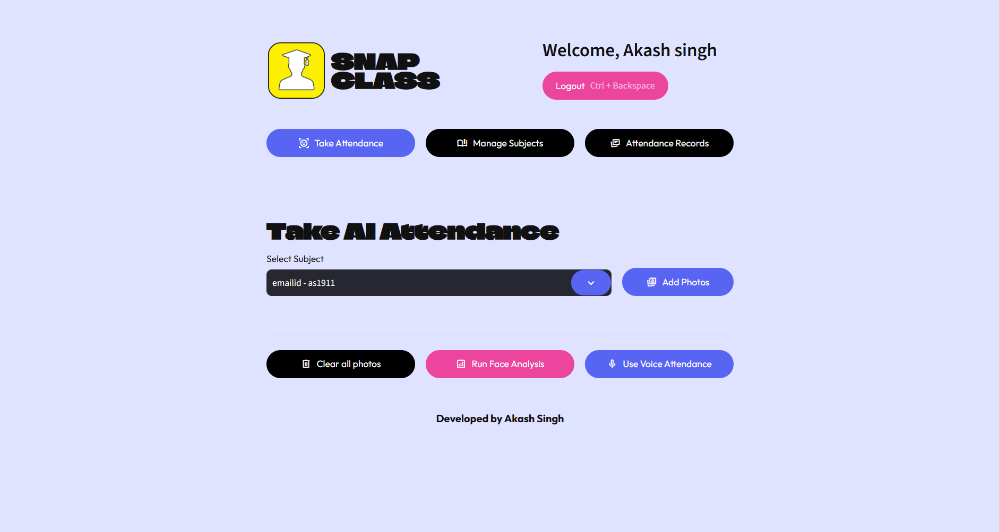

# 🎓 AI Attendance System

An AI-powered smart attendance management system that uses **Face Recognition** and optional **Voice Recognition** to simplify student attendance.

The application provides separate **Student** and **Teacher** portals and uses **Supabase** for cloud-based data storage.

## ✨ Features

### 👨‍🎓 Student Portal
- Face ID based student identification
- New student registration using facial data
- Optional voice enrollment
- Subject enrollment
- View enrolled subjects
- View attendance statistics
- Unenroll from subjects

### 👨‍🏫 Teacher Portal
- Teacher registration and login
- Create and manage subjects
- Manage enrolled students
- Attendance management
- Secure password hashing

## 🛠️ Tech Stack

- **Python**
- **Streamlit**
- **Supabase**
- **Face Recognition / Computer Vision**
- **Voice Processing**
- **NumPy**
- **Scikit-learn**
- **bcrypt**

## 📁 Project Structure

```text
AI-Attendance-System/
│
├── src/
│   ├── components/
│   ├── database/
│   ├── pipelines/
│   ├── screens/
│   └── ui/
│
├── app.py
├── requirements.txt
├── .gitignore
└── README.md
```
## 📸 Application Screenshots

### 🏠 Home Page


### 👨‍🎓 Student Face ID Login


### 📚 Student Subject Enrollment


### 📊 Student Dashboard


### 👨‍🏫 Teacher Login


### 📝 Teacher Registration


### 🔐 Teacher Username


### 📊 Teacher Dashboard


## ⚙️ Installation

Clone the repository:

```bash
git clone https://github.com/aakash15dec/AI-Attendance-System.git
```

Move into the project directory:

```bash
cd AI-Attendance-System
```

Create a virtual environment:

```bash
python -m venv venv
```

Activate it on Windows:

```bash
venv\Scripts\activate
```

Install dependencies:

```bash
pip install -r requirements.txt
```

## 🔐 Supabase Configuration

Create:

```text
.streamlit/secrets.toml
```

Add your own Supabase credentials:

```toml
SUPABASE_URL = "YOUR_SUPABASE_URL"
SUPABASE_KEY = "YOUR_SUPABASE_KEY"
```

> Never commit API keys or `secrets.toml` to GitHub.

## ▶️ Run the Application

```bash
streamlit run app.py
```

Then open the local Streamlit application in your browser.

## 🔒 Security

Sensitive configuration files, virtual environments and Python cache files are excluded from Git using `.gitignore`.

## 👨‍💻 Developer

**Akash Singh**

MCA – Artificial Intelligence  
SRM Institute of Science and Technology

## 🙏 Acknowledgement

This project was developed as a learning project based on the AI Attendance System tutorial/project by **Shradha Khapra / Apna College**.

I customized and extended the project while learning and implementing concepts related to Python, Streamlit, AI-based attendance workflows, Supabase integration and UI development.

The original project/tutorial remains credited to its respective creator.